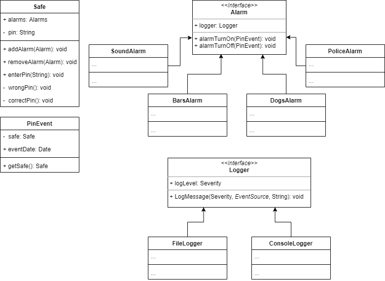

# Zadania laboratoryjne - interfejsy

| Liczba punktów do zdobycia  | Hard deadline   |
| ------------ | ------------ |
| 10  | 06.05.2023  23:59|

---
Zadaniem jest stworzenie klasy symulującej działanie sejfu. 
Użytkownik by otworzyć sejf musi podać *pin*.
W wypadku podania błędnego pinu do sejfu, zostanie wszczęty alarm. 
Działania podjęte w wyniku uruchomienia alarmu nie zależą od wykonawców sejfu. 
Co się stanie w odpowiedzi na wprowadzenie błędnego pinu zależy, od właściciela sejfu i zasobności jego portfela. 
Może on wynająć firmę ochroniarską, spuścić kratę, wypuścić psy itp.
Sejf powinien akceptować dowolne działania spełniające założenia wyrażone w interfejsie *Alarms.Alarm*.

Każdy dostawca urządzenia alarmowego pozwala do niego podłączyć dowolne urządzenie rejestrujące zdarzenia,
tzw. *Logger*. *Logger* uwzględnia:
- poziom ważności zdarzenia: *Severity*
- źródło zdarzenia: *EventSource*
- komunikat typu *String*

Zobacz na diagramie:

## Zadanie 1 (4 punkty)
Zaimplementuj klasę *Safe.Safe* wraz z wymaganymi klasami *Alarms.Alarm* i *Alarms.PinEvent*, bez systemu rejestracji zdarzeń. 

## Zadanie 2 (4 punkty)
Do implementacji z zadania 1 dodaj opisany system rejestracji zdarzeń wraz z przykładowymi implementacjami 
klas *FileLogger* oraz *ConsoleLogger*.

## Zadanie 3 (2 punkty)
Przeprowadź testy poprawności działania sejfu uwzględniając różne konfiguracje alarmów 
i urządzeń rejestrujących.

---
Zobacz także:
- M. Fowler [Inversion of Control Containers and the Dependency Injection pattern](https://www.martinfowler.com/articles/injection.html)
- R.C. Martin [The Dependency Inversion Principle](https://web.archive.org/web/20110714224327/http://www.objectmentor.com/resources/articles/dip.pdf)